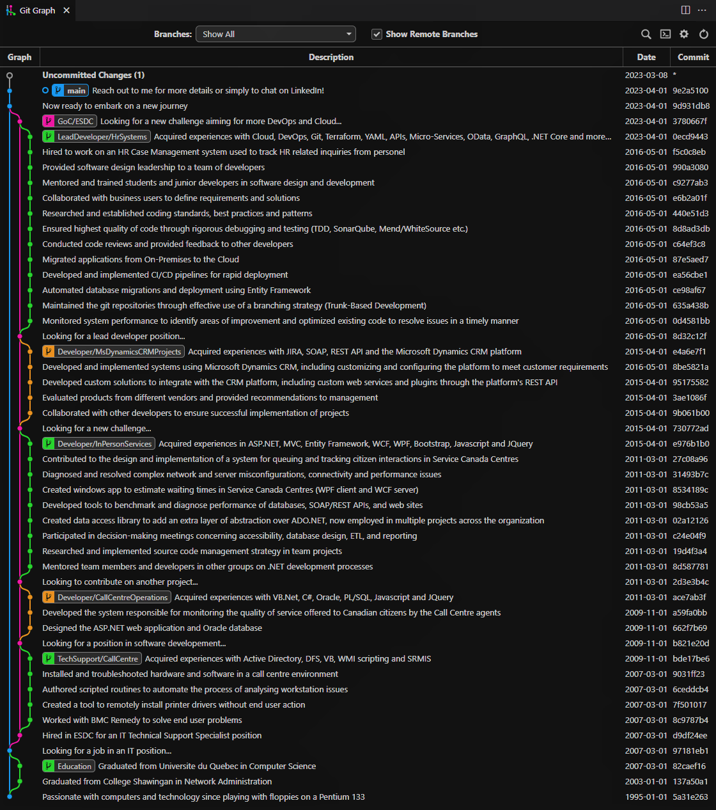

Results-oriented and passionate full-stack developer with 15+ years of experience in designing, developing and deploying innovative software solutions. 

Find me on <a href="https://www.linkedin.com/in/joel-belanger-698a86245/">LinkedIn</a>.

My work experiences can be found by viewing the history of this repository (git log or the <a href="https://marketplace.visualstudio.com/items?itemName=mhutchie.git-graph">GitGraph</a> extension for Visual Studio Code).

<pre>
$ git clone https://github.com/jbelanger/jbelanger.git
$ git log --pretty='%C(cyan)%ad %C(auto)%d %Creset%s' --graph --date=short
</pre>

Which should give the following:

